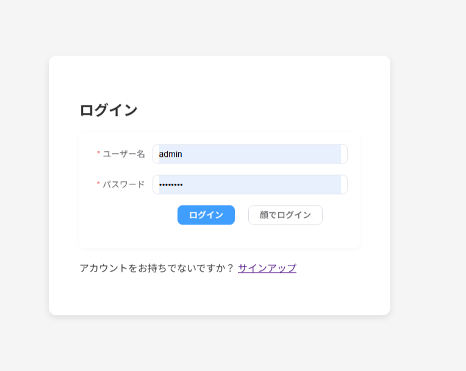
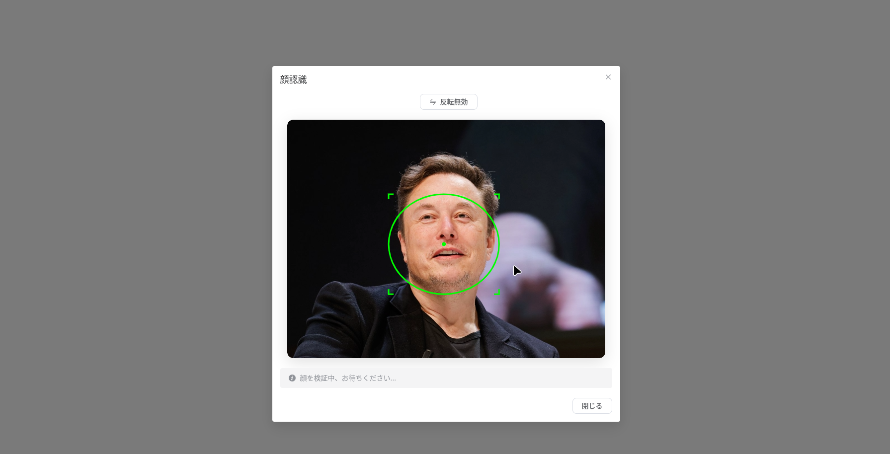
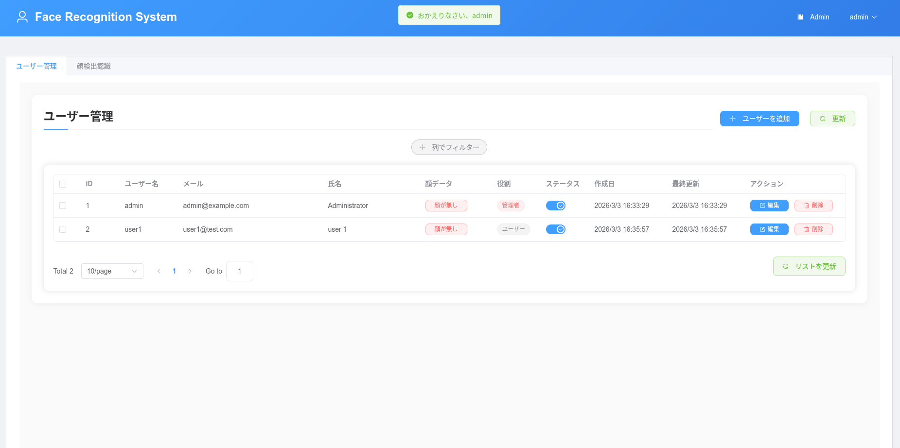
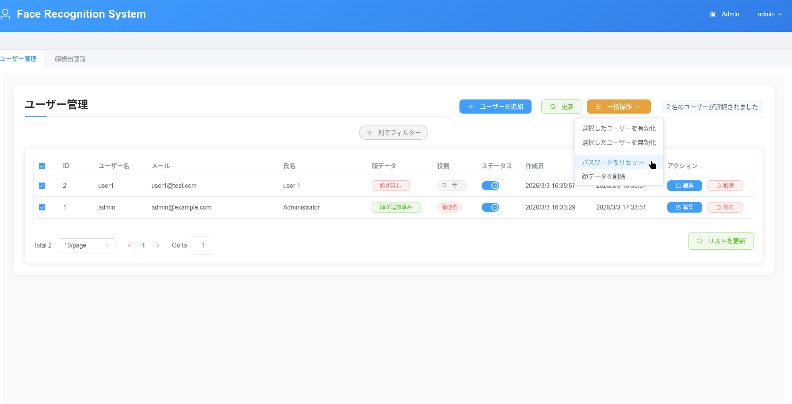
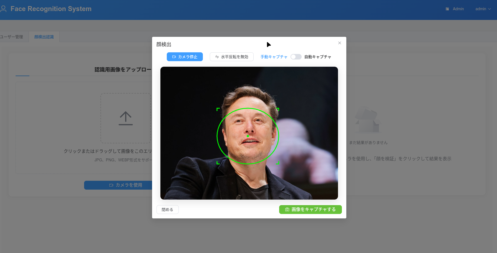
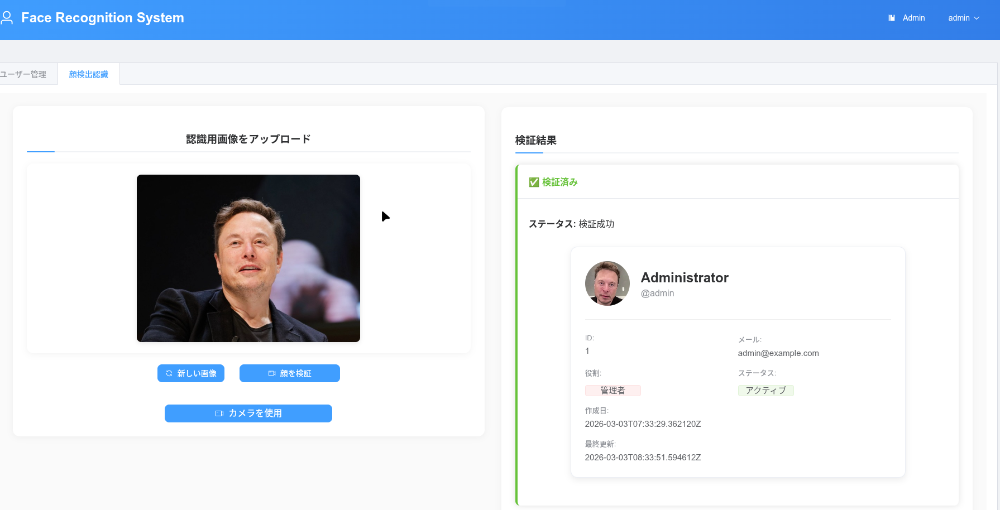
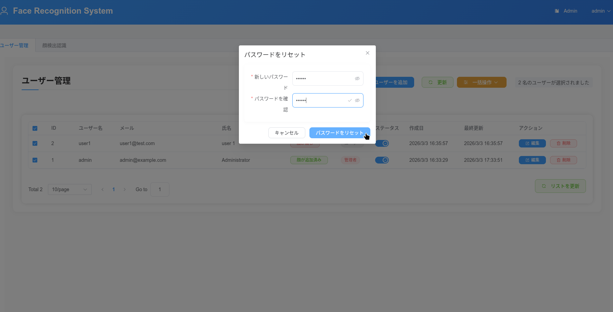
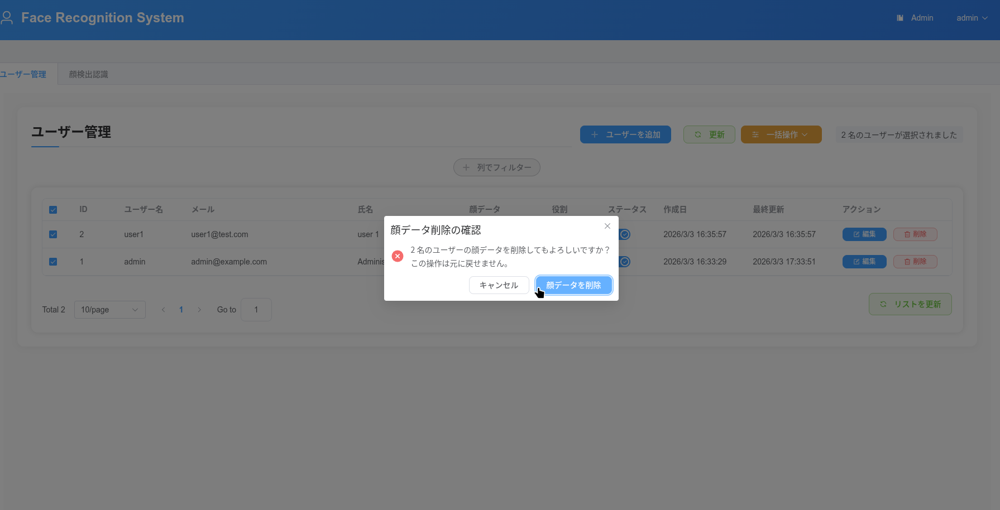

<div align="center">

# 臉部辨識系統

[](https://www.python.org/)
[](https://fastapi.tiangolo.com/)
[](https://vuejs.org/)
[](https://www.docker.com/)
[](LICENSE)

> 🚀 **基於 FastAPI + Vue.js + Docker 建構的現代化臉部辨識系統**

[🎮 觀看演示](https://huggingface.co/spaces/l2533584225/faceapi-demo) • [📚 文件](https://lijunjie2232.github.io/faceapi/)

[:us: English](README.en.md) • [:jp: 日本語](README.ja.md) • [:tw: 繁體中文](README.zh-TW.md)

</div>

## 📸 系統截圖

| 功能 | 截圖 |
|------|------|
| **登入頁面** - 使用者認證畫面 |  |
| **使用者註冊** - 新增帳戶建立 |  |
| **臉部驗證登入** - 快速臉部認證 |  |
| **管理者 - 使用者清單** - 使用者管理 |  |
| **管理者 - 批次操作** - 大量使用者管理 |  |
| **管理者 - 臉部檢測設定** - 檢測參數調整 |  |
| **管理者 - 臉部搜尋** - 臉部影像搜尋功能 |  |
| **管理者 - 密碼重設** - 使用者密碼管理 |  |
| **管理者 - 使用者臉部重設** - 臉部影像重新註冊 |  |

### 🎬 快速臉部驗證演示

以下 GIF 展示臉部驗證登入和臉部搜尋功能：


## 🌟 主要功能

- 🔐 **安全認證**: 基於 JWT 的使用者認證系統
- 👤 **臉部註冊**: 可為每位使用者註冊多張臉部圖片
- 🎯 **高精度辨識**: 先進的臉部檢測與識別功能
- 🖼️ **即時處理**: 基於網路攝影機的即時臉部辨識
- 📊 **管理儀表板**: 全面的使用者管理介面
- 🐳 **Docker 部署**: 簡單的容器化部署
- 🌐 **多語言支援**: 支援日文、繁體中文和英文
- 🚀 **GPU 加速**: 支援 GPU 的高效能處理

## 🎮 演示

線上試用系統：

[🎮 觀看演示](https://huggingface.co/spaces/l2533584225/faceapi-demo)

## 📚 文件

**提供多語言的完整文件：**

- 🌐 **線上文件**: https://lijunjie2232.github.io/faceapi/
- 📖 **本地文件**: 
  - [繁體中文文檔](docs/zh-TW/)
  - [日本語ドキュメント](docs/ja/)
  - [English Documentation](docs/en/)

> **💡 快速存取**: 請參考 [QUICKSTART.md](QUICKSTART.md) 進行快速設定

## 🚀 快速開始

### 系統需求

- Docker 20.10+
- Docker Compose 1.29+
- Git

### 安裝步驟

```bash
# 克隆儲存庫
git clone https://github.com/lijunjie2232/faceapi.git
cd face_recognition_system

# 產生環境設定檔
./deploy.sh generate-env dev

# 啟動所有服務
./deploy.sh up dev
```

### 存取服務

- **前端介面**: http://localhost:8080
- **後端 API**: http://localhost:8000
- **API 文件**: http://localhost:8000/docs
- **管理面板**: http://localhost:8080/admin

## 🏗️ 架構

### 技術堆疊

**後端**
- FastAPI - 現代化 Python 網頁框架
- Milvus - 用於臉部嵌入向量的向量資料庫
- PostgreSQL - 關聯式資料庫
- Tortoise ORM - 非同步 ORM
- face_recognition - 臉部檢測函式庫
- ONNX Runtime - ML 推論引擎

**前端**
- Vue 3 - 漸進式 JavaScript 框架
- Vite - 下一代建置工具
- face-api.js - JavaScript 臉部辨識
- Element Plus - UI 元件庫

**基礎設施**
- Docker - 容器化平台
- Docker Compose - 多容器編排
- Nginx - 反向代理和負載平衡器
- MinIO - 圖片物件儲存

## 📖 詳細文件

如需完整的指南，請參考我們的多語言文件：

| 文件 | 說明 | 語言 |
|------|------|------|
| [安裝指南](docs/zh-TW/install.md) | 完整的安裝說明 | 🇯🇵 🇹🇼 🇬🇧 |
| [部署指南](docs/zh-TW/deploy.md) | 生產環境部署策略 | 🇯🇵 🇹🇼 🇬🇧 |
| [開發指南](docs/zh-TW/dev.md) | 本地開發環境設定 | 🇯🇵 🇹🇼 🇬🇧 |
| [專案結構](PROJECT_STRUCTURE.md) | 詳細的程式碼組織 | 英文 |
| [快速開始](QUICKSTART.md) | 快速設定指南 | 日文 |

## 🐳 部署選項

### 1. Docker Compose (推薦)

```bash
# 開發環境
docker-compose -f docker-compose.dev.yml up -d

# 生產環境 (預先建置的映像檔)
docker-compose -f docker-compose.yml up -d

# GPU 啟用環境
docker-compose -f docker-compose.dev.gpu.yml up -d
```

### 2. 手動建置

```bash
# 建置後端映像檔
docker build -t face-rec-backend backend/

# 建置前端映像檔
docker build -t face-rec-frontend frontend/
```

## 🛠️ 開發

### 本地開發環境設定

```bash
# 後端設定
cd backend
pip install -e .
faceapi --gen-env .env
faceapi --debug

# 前端設定
cd frontend
pnpm install
pnpm serve
```

### API 端點

- **認證**: `/api/v1/users/login`, `/api/v1/users/signup`
- **臉部辨識**: `/api/v1/register-face`, `/api/v1/recognize-face`
- **使用者管理**: `/api/v1/user/profile`, `/api/v1/user/faces`
- **管理功能**: `/api/v1/admin/users`, `/api/v1/admin/stats`

## 🤝 貢獻

歡迎貢獻！請遵循以下步驟：

1. 分叉儲存庫
2. 建立功能分支 (`git checkout -b feature/amazing-feature`)
3. 提交變更 (`git commit -m 'Add amazing feature'`)
4. 推送到分支 (`git push origin feature/amazing-feature`)
5. 開啟拉取請求

## 📄 授權

本專案採用 MIT 授權 - 詳情請見 [LICENSE](LICENSE) 檔案。

## 🆘 支援

如有問題和疑問：

- 請先查看[文件](https://lijunjie2232.github.io/faceapi/)
- 在 [GitHub Issues](https://github.com/lijunjie2232/faceapi/issues) 回報問題
- 請參考 [QUICKSTART.md](QUICKSTART.md) 進行一般故障排除